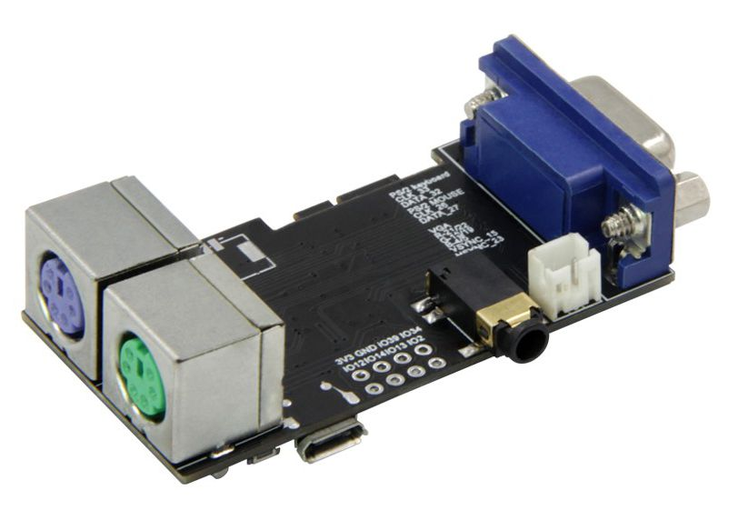

# Z1013e-VGA32
Z1013 Emulation auf VGA32 (ESP32)

Z1013 in Klein

Bei vielen Computerbegeisterten ist es so, dass sie eine besondere Beziehung zu ihrem ersten Computer haben. Dort kennt man sich aus.
Meine erste große Liebe war ein Z1013 zu dessen Geschichte ich nichts sagen möchte, da im Internet genug dazu geschrieben ist. Nur soviel: Auch ich war in Erfurt und musste meinen Z1013 abholen.
Viel wurde verändert. Tastatur, Speicher, Stromversorgung, RAM-Disk uvm. kamen dazu. Leider sind nicht alle Teile erhalten. 

Heute ist es schwer einen unverbastelten Z1013 zu bekommen. Die Preise sind unangemessen hoch. Zusatzmodule sind nicht zu bekommen. Wenn man wirklich etwas Neues für diesen Computer bauen möchte, scheitert es oft an den Steckverbindern, die schon lange nicht mehr produziert werden. Ein Ersatz gibt es nicht. Zumal die Steckverbinder ein ungewöhnliches Maß besitzen. 2,5 mm Raster gibt es heute nicht. Und bei 29 Pins machen 28 x 0,04 mm schon etwas aus.

Trotzdem ich Elektroniker bin, habe ich mich dazu entschlossen, eine Alternative zu suchen, bei der es kein Beschaffungsproblem gibt. Die meisten Programme des Z1013 liegen heute in digitaler Form vor, sodass es sich kaum lohnt, Programme von der Kassette auf eine Festplatte oder gar Diskette zu transferieren. Zumal es heute bessere Speichermöglichkeiten, wie USB-Stick und SD-Karte, gibt.

Wie es der Zufall so will, arbeite ich heute gerne mit dem ESP32.
Da liegt es doch nahe, etwas damit zu machen. Die Wahl ist auf ein fertiges Modul gefallen. Es ist unter der Bezeichnung VGA32 bekannt. Dies ist ein vollwertiger ESP32 mit einer VGA-Schnittstelle und 2 PS/2 Schnittstellen für Tastatur und Maus. Ein SD-Karten-Slot ist auch vorhanden. Es sei noch eine Anschlussmöglichkeit für Soundgeräte und eine Buchse für einen Akku erwähnt. Eine genaue Beschreibung dieses Moduls ist im Internet zu finden.

[VGA32](seidat1.github.com/Z1013e-VGA32/Bilder/VGA32.jpg)

Der ESP32 bietet genug Speicher um einen Z80-Emulator und die Software für die Ansteuerung des VGA-Monitors unterzubringen.
Der RAM ist auch großgenug für die 64KB eines Z80-Systems. 
Mir war es wichtig, das Original-Betriebssystem des Z1013 zu benutzen. Mit einer kleinen Ausnahme ist dies auch gelungen. 
Zur Geschwindigkeit ist zu sagen, dass sie in etwa an die 2MHz Variante des Z1013 herankommt. Einzelne Befehle laufen schneller, die Grafikausgabe ist etwas langsamer. Aber alles ist im Rahmen des Brauchbaren. 
 
Eins der großen Probleme war es, die Tastatur anzupassen, sodass eine PS/2-Tastatur am Monitorprogramm des Z1013 läuft. Wie erwähnt, war es nicht das Ziel die Software des Z1013 anzupassen. Es läuft ein original Monitorprogramm 2.02 mit der Größe von 2kB. Vielmehr war es die Schwierigkeit die Tastatur so anzupassen, dass die richtigen Signale vom ESP32 an die Software des Z1013 gesendet werden.
Damit entsteht aber ein weiteres Problem. Viele Z1013 wurden  umgebaut und Hard- und Software so angepasst, dass man eine Schreibmaschinentastatur anschließen konnte. Auf diese wurde hier keine Rücksicht genommen. Wenn es Software gibt, die mit der originalen Software für die 8x4-Tastatur nicht läuft, wird sie mit dieser Emulation auch nicht laufen. Auch Anpassungen, um die 8x4-Tastaturroutine schneller zu machen, wie ich es in einigen Spielen gesehen habe, werden zurzeit nicht berücksichtigt.

Wenn jemand Lust hat, mit mir weiter an diesem Projekt zu arbeiten, kann er gerne mit mir in Kontakt treten und wir werden uns einigen, wer was macht.
In Planung ist, dass man einen Kassettenrekorder anschließen kann, um die Software von Kassette einzulesen. 
Dafür wird dann auch eine Möglichkeit benötigt, um die Programme auf SD-Karte abzuspeichern.
Eine weitere Idee ist, den RAM zu erweitern, somit wäre eine RAM-Disk möglich der VGA32 (ESP32) hat 520kB RAM von dem noch viel ungenutzt ist. 

Guido alias seidat
